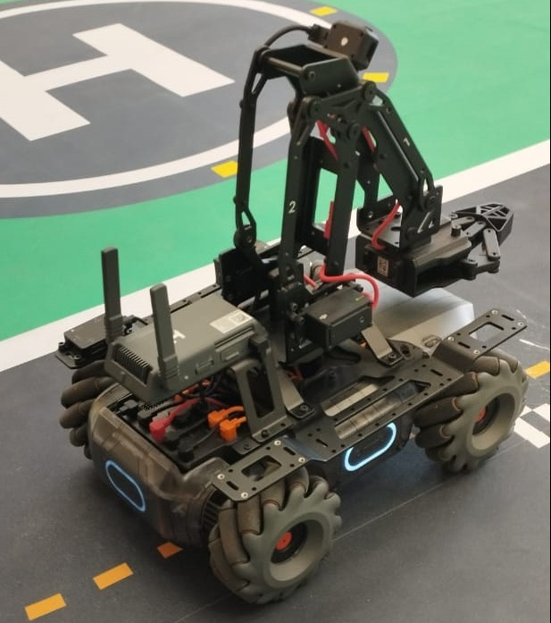

# MobileRobot-Openloopcontrol
## Aim:

To develop a python control code to move the mobilerobot along the predefined path.

## Equipments Required:
1. RoboMaster EP core
2. Python 3.7

## Procedure

Step1:

Import necessary modules from the RoboMaster SDK.

Step2:
Check if the script is being run as the main module.


Step3:
Initialize the robot connection using "ap" (access point) mode.


Step4:
Get references to the robot's chassis, LED, and camera objects.


Step5:
Command the robot to move and change LED colors/effects at different positions:
1.Move the robot forward by 2.8 meters, set LED color to yellow.
2.Move the robot up by 50 degrees, set LED color to purple.
3.Move the robot forward by 0.6 meters, set LED color to yellow.
4.Move the robot up by 55 degrees, set LED color to purple.
5.Move the robot forward by 0.6 meters, set LED color to yellow.
6.Move the robot up by 62 degrees, set LED color to blue.
7.Move the robot forward by 1.5 meters, set LED color to red.
8.Move the robot down by 28 degrees, set LED color to green.
9.Move the robot forward by 1.3 meters, set LED color to dark purple.
10.Move the robot up by 40 degrees, set LED color to magenta.
11.Move the robot forward by 1.5 meters, set LED color to cyan.
12.Move the robot up by 90 degrees, set LED color to dark green.
13.Move the robot forward by 1.8 meters, set LED color to dark blue.
14.Move the robot up by 55 degrees, set LED color to cyan.
15.Move the robot forward by 0.5 meters, set LED color to light blue.
16.Move the robot up by 30 degrees, set LED color to light purple.
17.Move the robot forward by 0.5 meters, set LED color to light purple


step6:
Wait for 4 seconds.

step7:
Close the robot connection.

## Program
```python
#python control code to move the mobilerobot along the predefined path.
#eveloped by:SRee Hari K
#Register Number:23000908
from robomaster import robot
import time
from robomaster import camera

if _name_ == '_main_':
    ep_robot = robot.Robot()
    ep_robot.initialize(conn_type="ap")

    ep_chassis = ep_robot.chassis
    ep_led = ep_robot.led
    ep_camera = ep_robot.camera

    print("Video streaming started.....")
    ep_camera.start_video_stream(display=True, resolution = camera.STREAM_360P)


    ep_chassis.move(x =2.8,y=0,z=0,xy_speed=0.75).wait_for_completed()
    ep_led.set_led(comp="all",r=255,g=0,b=0,effect="on")
    

    ep_chassis.move(x =0,y=0,z=50,xy_speed=0.75).wait_for_completed()
    ep_led.set_led(comp="all",r=255,g=0,b=0,effect="on")


    ep_chassis.move(x =0.5,y=0,z=0,xy_speed=0.75).wait_for_completed()
    ep_led.set_led(comp="all",r=255,g=255,b=0,effect="on")

    ep_chassis.move(x =0,y=0,z=50,xy_speed=0.75).wait_for_completed()
    ep_led.set_led(comp="all",r=255,g=0,b=255,effect="on")

    ep_chassis.move(x =0.8,y=0,z=0,xy_speed=0.75).wait_for_completed()
    ep_led.set_led(comp="all",r=128,g=128,b=0,effect="on")

    ep_chassis.move(x =0,y=0,z=80,xy_speed=0.75).wait_for_completed()
    ep_led.set_led(comp="all",r=255,g=255,b=0,effect="on")

    ep_chassis.move(x =1.4,y=0,z=0,xy_speed=0.75).wait_for_completed()
    ep_led.set_led(comp="all",r=128,g=255,b=0,effect="on")

    ep_chassis.move(x =0,y=0,z=-45,xy_speed=0.75).wait_for_completed()
    ep_led.set_led(comp="all",r=255,g=255,b=0,effect="on")

    ep_chassis.move(x =1.5,y=0,z=0,xy_speed=0.75).wait_for_completed()
    ep_led.set_led(comp="all",r=0,g=0,b=0,effect="on")

    ep_chassis.move(x =0,y=0,z=45,xy_speed=0.75).wait_for_completed()
    ep_led.set_led(comp="all",r=255,g=128,b=0,effect="on")

    ep_chassis.move(x =1.5,y=0,z=0,xy_speed=0.75).wait_for_completed()
    ep_led.set_led(comp="all",r=255,g=255,b=255,effect="on")
    
    ep_chassis.move(x =0,y=-0.3,z=0,xy_speed=0.75).wait_for_completed()
    ep_led.set_led(comp="all",r=0,g=255,b=0,effect="on")

    ep_chassis.move(x =0,y=0,z=95,xy_speed=0.75).wait_for_completed()
    ep_led.set_led(comp="all",r=255,g=0,b=255,effect="on")

    ep_chassis.move(x =1.7,y=0,z=0,xy_speed=0.75).wait_for_completed()
    ep_led.set_led(comp="all",r=255,g=255,b=0,effect="on")

    ep_chassis.move(x =0,y=0,z=70,xy_speed=0.75).wait_for_completed()
    ep_led.set_led(comp="all",r=255,g=255,b=0,effect="on")

    ep_chassis.move(x =0.7,y=0,z=0,xy_speed=0.75).wait_for_completed()
    ep_led.set_led(comp="all",r=0,g=0,b=255,effect="on") 


    ep_chassis.move(x =0,y=0,z=20,xy_speed=0.75).wait_for_completed()
    ep_led.set_led(comp="all",r=0,g=255,b=0,effect="on") 


    time.sleep(4)
    ep_camera.stop_video_stream()
    print("Stopped video streaming.....")

    ep_robot.close()
```

## MobileRobot Movement Image:




## Result:
Thus the python program code is developed to move the mobilerobot in the predefined path.


```
Mobile Robotics Laboratory
Department of Artificial Intelligence and Data Science/ Machine Learning
Saveetha Engineering College
```
